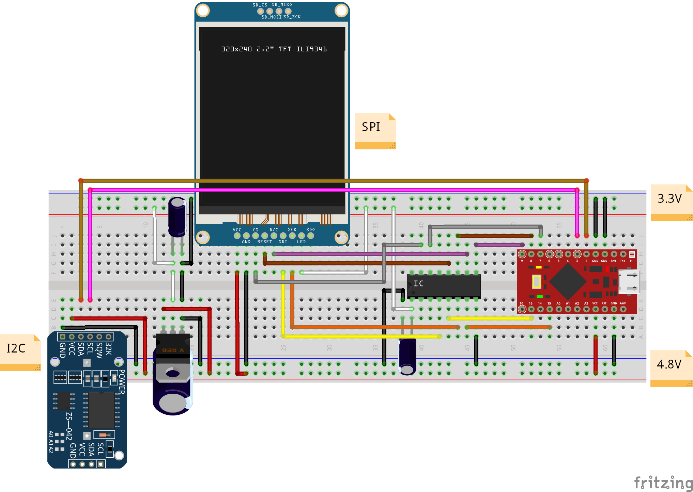

# Arduino example sketch

This sketch was developed on a Leonardo board and demonstrates the classes as per below.

XUtils:
- the use of `xatoi()` instead of the `Serial.parseInt()` function as the latter doesn't report parsing errors;
  
XConsole:
- the use of `xprintf()` mixed with `Serial.println()`, the former inherited from *XUtils* for formatted output;
- the use of `xputs()`, also inherited from *XUtils*, for outputting paragraphs with embedded LF characters, optionally converted to CRLF;

RTC (Pin 2: SDA, Pin 3: SCL):
- how to set/get the current time with a Maxim DS3231 RTC IC;

TMP006 (Pin 2: SDA, Pin 3: SCL):
- how to get a temperature reading from a TMP006 contactless temperature sensor;

ILI9341 (Pin 16: SPI MOSI, Pin 14: SPI MISO, Pin 15: SPI SCK, Pin 7: SPI SS, Pin 8: ILI RESET, Pin 9: ILI D/C):
- the use of various graphic operations, including lines, rectangles, text, etc.;
- the use of `xprintf()` and `xputs()` inherited from *XConsole*, whom *ILI9341* is a child class of;

## Reference circuit

Voltage regulator (VREG): LM1117-3.3
Level shifter (IC): 74HC4050N
